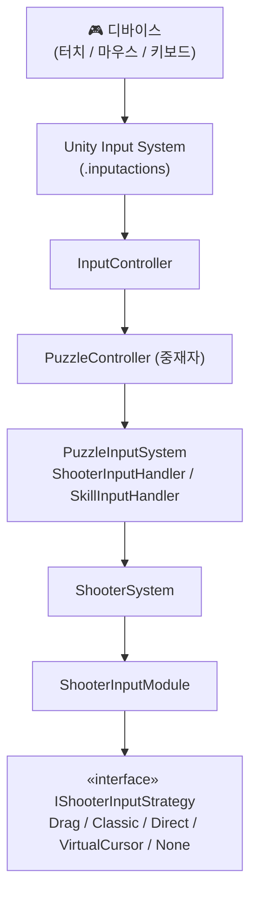

# 마왕 수박 게임

> 써드파티 에셋 라이센스로 인해 전체 프로젝트가 아닌 C# 스크립트만 포함

- v1 : 출시 후 서비스 종료
- v2 : 개선 및 차기작(미출시)

## v1 핵심 구현

### SO 이벤트 채널
의존성 필요한 모든 클래스에 이벤트 채널을 사용
[ScoreManager.cs](v1/Stage/Score/ScoreManager.cs), [GameOverSystem.cs](v1/Stage/GameOver/GameOverSystem.cs) 등

---

## v2 핵심 구현
### 아키텍처 개선

코드의 흐름이 명확해지고 필요한 책임만 져서 간결해짐

| v1 | v2 |
|----|----|
| [ScoreManager.cs](v1/Stage/Score/ScoreManager.cs) | [ScoreSystem.cs](v2/Gameplay/Puzzle/Score/ScoreSystem.cs) |
| | [ScoreModel.cs](v2/Gameplay/Puzzle/Score/ScoreModel.cs) |
| | [ScoreVisualizer.cs](v2/Gameplay/Puzzle/Score/ScoreVisualizer.cs) |

---

### 전략 패턴 입력 시스템

| 파일 | 역할 |
|------|------|
| [InputController.cs](v2/Core/Input/InputController.cs) | Unity Input System 래퍼, scheme/device 변경 이벤트 발행 |
| [PuzzleController.cs](v2/Gameplay/Puzzle/PuzzleController.cs) | 퍼즐 전체 흐름 조율, 입력값 polling 명령 및 전달 |
| [PuzzleInputSystem.cs](v2/Gameplay/Puzzle/Input/PuzzleInputSystem.cs) | 입력 시스템 진입점, ShooterInputHandler / SkillInputHandler 관리 |
| [ShooterInputHandler.cs](v2/Gameplay/Puzzle/Input/ShooterInputHandler.cs) | InputAction 폴링, DeadZone 처리(물리적) |
| [ShooterSystem.cs](v2/Gameplay/Puzzle/Shooter/ShooterSystem.cs) | 슈터 전체 로직 관리 |
| [ShooterInputModule.cs](v2/Gameplay/Puzzle/Shooter/Input/ShooterInputModule.cs) | 전략 패턴을 활용하여 입력 방식에 따라 전략 결정 |
| [IShooterInputStrategy.cs](v2/Gameplay/Puzzle/Shooter/Input/Strategy/IShooterInputStrategy.cs) | 입력 전략 인터페이스 |
| [ShooterDragStrategy.cs](v2/Gameplay/Puzzle/Shooter/Input/Strategy/ShooterDragStrategy.cs) | 드래그 입력 전략 |
| [ShooterClassicStrategy.cs](v2/Gameplay/Puzzle/Shooter/Input/Strategy/ShooterClassicStrategy.cs) | 클래식 입력 전략 |
| [ShooterDirectStrategy.cs](v2/Gameplay/Puzzle/Shooter/Input/Strategy/ShooterDirectStrategy.cs) | 다이렉트 입력 전략 |
| [ShooterVirtualCursorStrategy.cs](v2/Gameplay/Puzzle/Shooter/Input/Strategy/ShooterVirtualCursorStrategy.cs) | 가상 커서 입력 전략 |
| [ShooterNoneStrategy.cs](v2/Gameplay/Puzzle/Shooter/Input/Strategy/ShooterNoneStrategy.cs) | None 전략 (입력 비활성화) |
