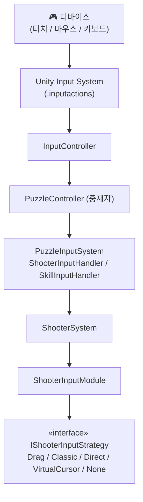

# 마왕 수박 게임
> 써드파티 에셋 라이센스로 인해 전체 프로젝트가 아닌 C# 스크립트만 포함

> 수박 게임 류 | Unity | 1인 개발 | 안드로이드 | 출시

- v1 : 출시 후 서비스 종료
- v2 : 개선 및 차기작(미출시)

### 트레일러
[](https://www.youtube.com/watch?v=L1Ubq69U_OY)


## v1 핵심 구현

### SO 이벤트 채널

ScriptableObject를 이벤트 채널로 사용해 씬 계층 간 의존 없이 통신하는 구조.
`capsuleMergedEventSO`, `stageEndEvent` 등 SO를 Inspector에서 주입받아 구독합니다.

| 파일 | 역할 |
|------|------|
| [ScoreManager.cs](v1/Stage/Score/ScoreManager.cs) | 합체 이벤트 구독 → 점수 계산 → 점수 획득 이벤트 발행 |
| [GameOverSystem.cs](v1/Stage/GameOver/GameOverSystem.cs) | 게임오버 조건 감지 및 이벤트 발행 |

```csharp
// ScoreManager.cs
private void Awake()
{
    capsuleMergedEventSO.OnEventRaised += OnCapsuleMerged; // SO 이벤트 구독
    curComboVarSO.OnValueChanged += OnComboChanged;
    stageEndEvent.OnEventRaised += OnStageEnded;
}

private void OnCapsuleMerged(int level)
{
    var getScore = (int)(gashaponScoreDataSO.value[level] * _scoreMultiplier);
    curScore += getScore;
    scoreGetEventSO.RaiseEvent(getScore); // 점수 획득 이벤트 발행
}
```

씬 구조나 실행 순서와 무관하게 연결되는 점은 장점이지만, 변경 가능성이 낮은 영역까지 이벤트 채널을 도입해 간접 계층이 과도하게 늘어난 부분도 있었습니다.

---

## v2 핵심 구현

### 전략 패턴 입력 시스템

입력 방식(드래그/클래식/다이렉트 등)을 `Dictionary`로 관리해 런타임에 교체합니다.
새 입력 방식 추가 시 `IShooterInputStrategy`를 구현하고 Dictionary에 등록하면 됩니다.


```mermaid
flowchart TD
    Device["🎮 디바이스\n(터치 / 마우스 / 키보드)"]
    UIS["Unity Input System\n(.inputactions)"]
    IC["InputController"]
    PC["PuzzleController (중재자)"]
    PIS["PuzzleInputSystem\nShooterInputHandler / SkillInputHandler"]
    SS["ShooterSystem"]
    SIM["ShooterInputModule"]
    STRAT["«interface» IShooterInputStrategy\nDrag / Classic / Direct / VirtualCursor / None"]

    Device --> UIS --> IC --> PC
    PC --> PIS
    PIS --> SS
    SS --> SIM --> STRAT
```

| 파일 | 역할 |
|------|------|
| [InputController.cs](v2/Core/Input/InputController.cs) | Unity Input System 래퍼, scheme/device 변경 이벤트 발행 |
| [PuzzleController.cs](v2/Gameplay/Puzzle/PuzzleController.cs) | 퍼즐 전체 흐름 조율, 입력값 polling 명령 및 전달 |
| [PuzzleInputSystem.cs](v2/Gameplay/Puzzle/Input/PuzzleInputSystem.cs) | 입력 시스템 진입점, ShooterInputHandler / SkillInputHandler 관리 |
| [ShooterInputHandler.cs](v2/Gameplay/Puzzle/Input/ShooterInputHandler.cs) | InputAction 폴링, DeadZone 처리(물리적) |
| [ShooterSystem.cs](v2/Gameplay/Puzzle/Shooter/ShooterSystem.cs) | 슈터 전체 로직 관리 |
| [ShooterInputModule.cs](v2/Gameplay/Puzzle/Shooter/Input/ShooterInputModule.cs) | 전략 패턴을 활용하여 입력 방식에 따라 전략 결정 |
| [IShooterInputStrategy.cs](v2/Gameplay/Puzzle/Shooter/Input/Strategy/IShooterInputStrategy.cs) | 입력 전략 인터페이스 |
| [ShooterDragStrategy.cs](v2/Gameplay/Puzzle/Shooter/Input/Strategy/ShooterDragStrategy.cs) | 드래그 입력 전략 |
| [ShooterClassicStrategy.cs](v2/Gameplay/Puzzle/Shooter/Input/Strategy/ShooterClassicStrategy.cs) | 클래식 입력 전략 |
| [ShooterDirectStrategy.cs](v2/Gameplay/Puzzle/Shooter/Input/Strategy/ShooterDirectStrategy.cs) | 다이렉트 입력 전략 |
| [ShooterVirtualCursorStrategy.cs](v2/Gameplay/Puzzle/Shooter/Input/Strategy/ShooterVirtualCursorStrategy.cs) | 가상 커서 입력 전략 |
| [ShooterNoneStrategy.cs](v2/Gameplay/Puzzle/Shooter/Input/Strategy/ShooterNoneStrategy.cs) | None 전략 (입력 비활성화) |

```csharp
// ShooterInputModule.cs
_strategies = new Dictionary<ShooterInputType, IShooterInputStrategy>()
{
    { ShooterInputType.None,          new ShooterNoneStrategy() },
    { ShooterInputType.Drag,          new ShooterDragStrategy(area) },
    { ShooterInputType.Classic,       new ShooterClassicStrategy() },
    { ShooterInputType.Direct,        new ShooterDirectStrategy() },
    { ShooterInputType.VirtualCursor, new ShooterVirtualCursorStrategy() },
};

private void SwitchStrategy(ShooterInputType type)
{
    if (_curStrategy.InputType == type) return;
    _curStrategy.Exit();
    _curStrategy = _strategies[type];
    _curStrategy.Enter();
}
```

### 아키텍처 개선

v1의 `ScoreManager`는 데이터·계산·표시를 모두 떠안았지만, v2에서는 Model(계산)·View(표시)·System(조율)으로 분리했습니다.

```csharp
// v2 ScoreSystem.cs — 계산은 Model, 표시는 Visualizer로 위임
public void HandleSuikaMerged(MergeEvent mergeEvent)
{
    visualizer.UpdateMainScore(_scoreModel.CurrentScore);
    ScoreChanged?.Invoke(_scoreModel.CurrentScore);
}
```

| v1 | v2 |
|----|----|
| [ScoreManager.cs](v1/Stage/Score/ScoreManager.cs) | [ScoreSystem.cs](v2/Gameplay/Puzzle/Score/ScoreSystem.cs) |
| | [ScoreModel.cs](v2/Gameplay/Puzzle/Score/ScoreModel.cs) |
| | [ScoreVisualizer.cs](v2/Gameplay/Puzzle/Score/ScoreVisualizer.cs) |


### 빌더 패턴

생성자 파라미터가 길어지는 것을 막고, `Build()` 시점에 필수 값 누락을 강제합니다.

```csharp
// PuzzleContext.cs
public PuzzleContext Build()
{
    if (_playerContext == null) throw new InvalidOperationException($"{nameof(_playerContext)} is null.");
    if (_tierConfig == null)    throw new InvalidOperationException($"{nameof(_tierConfig)} is null.");
    if (_area == null)          throw new InvalidOperationException($"{nameof(_area)} is null.");

    return new PuzzleContext
    {
        PlayerContext = _playerContext,
        Area = _area,
        TierDataTable = new SuikaTierDataTable(SuikaTierDataBuilder.Build(_tierConfig, _playerContext.MonsterLoadout))
    };
}

// 사용처
var context = new PuzzleContext.Builder()
    .SetPlayerContext(playerContext)
    .SetTierConfig(tierConfig)
    .SetArea(area)
    .Build();
```

---

## 핵심 코드 구조

### v1

```
v1/
├── SO/                        # ScriptableObject 기반 이벤트/변수 채널
│   ├── 01_Variable/           # 변수 SO (Int, Float, Bool 등)
│   ├── 02_Data/               # 데이터 SO
│   └── 03_Event/              # 이벤트 채널 SO
├── Stage/                     # 게임 플레이
│   ├── Gashapon/              # 수박 오브젝트 (발사, 합체, 큐)
│   ├── Combo/                 # 콤보 시스템
│   ├── Score/                 # 점수
│   ├── Battle/                # 배틀
│   ├── Overlord/              # 마왕 반응형 대사
│   └── GameOver/              # 게임오버
└── System/                    # 공통 시스템 (Audio, UI, Scene 등)
```

### v2

```
v2/
└── Gameplay/                  # 게임 특화 로직
    └── Puzzle/
        ├── Input/             # 입력 시스템 ★
        ├── Shooter/           # 슈터 (전략 패턴) ★
        └── Score/             # 점수 (Model-View 분리)
```


